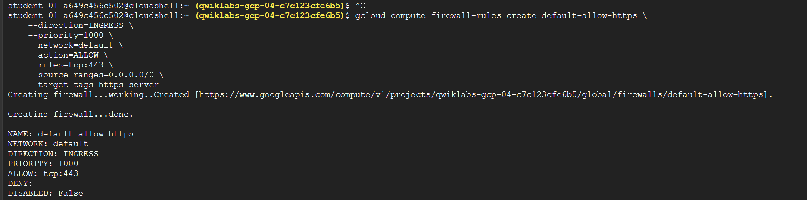
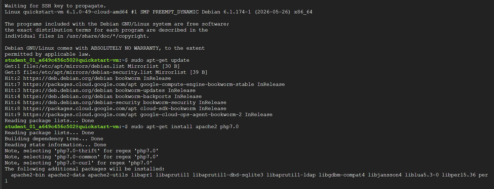
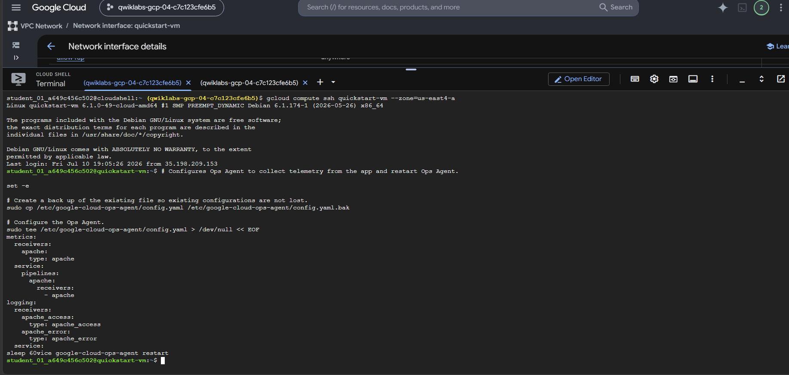
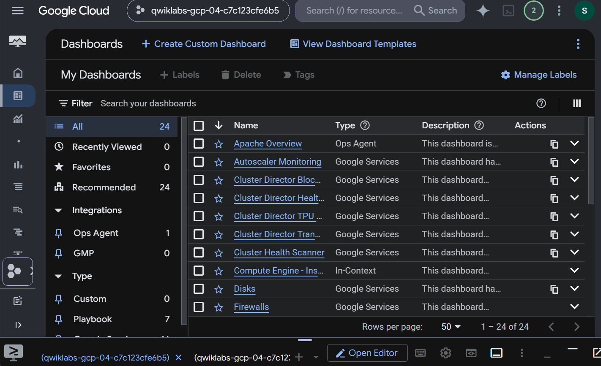
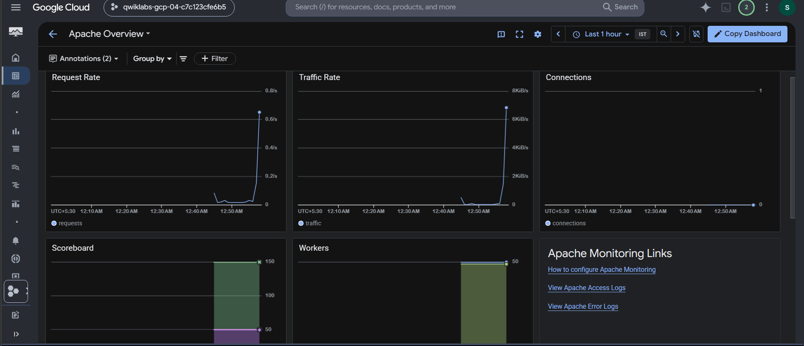
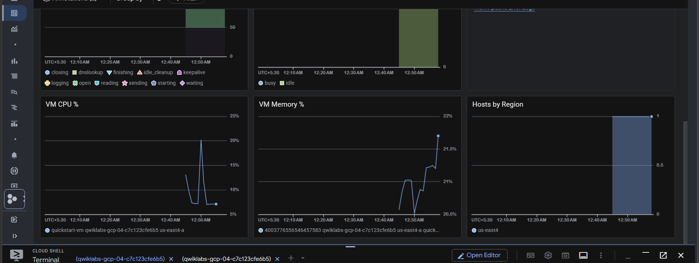

#  Compute Engine Monitoring with Ops Agent and Apache

## Executive Summary
This repository contains reference configurations and instructions for deploying the unified Google Cloud Ops Agent<!-- TODO: add official doc link --> on a Compute Engine<!-- TODO: add official doc link --> VM hosting Apache Web Server<!-- TODO: add official doc link -->. By implementing this architecture, enterprise platform teams can automate the ingestion of application-level logs and server metrics into Cloud Logging<!-- TODO: add official doc link --> and Cloud Monitoring<!-- TODO: add official doc link --> for central visualization and alerting.

## Architecture Overview

```mermaid
graph TD
    subgraph VPC ["Google Cloud VPC"]
      subgraph Subnet ["Subnet"]
        VM ["Compute Engine VM: quickstart-vm"]
        subgraph OpsAgent ["Ops Agent Telemetry Pipeline"]
          OB ["OpenTelemetry Collector (Metrics)"]
          FB ["Fluent Bit (Logs)"]
        end
        Apache ["Apache Web Server"]
      end
      FW ["Firewall Rules (Allow HTTP/HTTPS)"]
    end
    Internet ["Internet Clients / curl Traffic Generator"]
    Monitoring ["Cloud Monitoring"]
    Logging ["Cloud Logging"]

    Internet -->|HTTP/HTTPS Port 80/443| FW
    FW --> VM
    VM --> Apache
    Apache -->|Access/Error Logs| FB
    Apache -->|Server Status Metrics| OB
    FB -->|Ingest Logs| Logging
    OB -->|Ingest Metrics| Monitoring
```

The architecture is designed to capture full-stack telemetry from a virtualized application server. The Apache Web Server<!-- TODO: add official doc link --> runs on a Compute Engine<!-- TODO: add official doc link --> instance within a secure Google Cloud [VPC](https://cloud.google.com/vpc/docs). The Ops Agent<!-- TODO: add official doc link --> runs side-by-side with Apache<!-- TODO: add official doc link -->, tailing access and error logs via its Fluent Bit engine, and scraping server status metrics via its OpenTelemetry Collector engine. These data streams are securely routed to Cloud Logging<!-- TODO: add official doc link --> and Cloud Monitoring<!-- TODO: add official doc link --> over private Google API endpoints.

## Business Problem
Enterprise operations teams require centralized visibility into virtual machine workloads to meet SLA agreements, troubleshoot outages, and detect anomalous traffic patterns. Manually configuring separate telemetry collectors, maintaining custom log-parsing scripts, and managing agent security updates introduces operational overhead, increases the Mean Time to Detection (MTTD), and risks configuration drift across large VM fleets.

## Solution Overview
By deploying the unified Google Cloud Ops Agent<!-- TODO: add official doc link --> on Compute Engine<!-- TODO: add official doc link --> VM instances, organizations establish a standard, scalable, and low-footprint telemetry pipeline. This pipeline automates the collection, parsing, and ingestion of system metrics, application status metrics, and log streams. Using native Cloud Monitoring<!-- TODO: add official doc link --> integration, operators gain access to out-of-the-box dashboards that automatically visualize Apache<!-- TODO: add official doc link --> status code distributions, traffic volume, and host resource utilization.

## Reference Architecture
The deployment comprises the following primary components:
1. **Virtual Machine**: A single Compute Engine<!-- TODO: add official doc link --> VM (`quickstart-vm`) running Debian GNU/Linux 12 (bookworm).
2. **Web Server**: Apache HTTP Server<!-- TODO: add official doc link --> exposing standard web pages and local `/server-status` telemetry endpoints.
3. **Telemetry Agent**: Google Cloud Ops Agent<!-- TODO: add official doc link --> configured with an Apache<!-- TODO: add official doc link --> receiver to scrape metrics and access/error logs.
4. **Backend Services**: Cloud Logging<!-- TODO: add official doc link --> for log retention and searching, and Cloud Monitoring<!-- TODO: add official doc link --> for metrics storage and dashboard visualization.

## Google Cloud Service Explanations

✦ Compute Engine<!-- TODO: add official doc link -->

Compute Engine<!-- TODO: add official doc link --> is Google Cloud's Infrastructure-as-a-Service (IaaS) offering that runs virtual machine instances on Google's infrastructure.

It provides scalable and customizable compute capacity while allowing teams to focus on application deployment rather than physical hardware maintenance.

### Enterprise Use Cases
• Hosting legacy monolithic applications and stateful workloads.
• Custom database clustering and high-performance computing (HPC).
• Hybrid cloud integrations requiring deep operating system control.

---

✦ Virtual Private Cloud (VPC) — [docs](https://cloud.google.com/vpc/docs)

Virtual Private Cloud (VPC) — [docs](https://cloud.google.com/vpc/docs) — is Google Cloud's managed virtual network for resource isolation and traffic routing.

It provides private network connectivity for VM instances while allowing network security teams to centrally manage firewall rules, routing policies, and hybrid connections.

### Enterprise Use Cases
• Network isolation for sensitive workloads and databases.
• Fine-grained traffic filtering using VPC firewall policies.
• Private access to Google APIs and Services.

---

✦ Google Cloud Ops Agent<!-- TODO: add official doc link -->

Google Cloud Ops Agent<!-- TODO: add official doc link --> is the primary telemetry collection agent for Compute Engine<!-- TODO: add official doc link --> VMs, combining Fluent Bit for log collection and OpenTelemetry Collector for metric collection.

It ingests system and application metrics and logs into Cloud Logging<!-- TODO: add official doc link --> and Cloud Monitoring<!-- TODO: add official doc link --> while allowing administrators to define pipelines via a unified YAML configuration.

### Enterprise Use Cases
• Monitoring system resources (CPU, Memory, Disk, Network) across VM fleets.
• Ingesting application logs (Apache<!-- TODO: add official doc link -->, Nginx, MySQL) with pre-defined parsers.
• Custom metrics collection from custom applications using Prometheus or StatsD receivers.

---

✦ Cloud Monitoring<!-- TODO: add official doc link -->

Cloud Monitoring<!-- TODO: add official doc link --> is Google Cloud's managed observability and performance monitoring service.

It stores and visualizes metrics, events, and metadata while allowing operations teams to build real-time dashboards and alerting policies.

### Enterprise Use Cases
• Real-time infrastructure and application performance monitoring.
• Proactive SLA/SLO alerting based on threshold conditions.
• Out-of-the-box integration dashboards for third-party software (e.g. Apache<!-- TODO: add official doc link -->, Nginx).

---

✦ Cloud Logging<!-- TODO: add official doc link -->

Cloud Logging<!-- TODO: add official doc link --> is Google Cloud's fully managed, real-time log management and analysis service.

It ingests, indexes, and stores log data from all Google Cloud services and user agents while allowing administrators to query logs using Log Analytics or stream them to external destinations.

### Enterprise Use Cases
• Centralized application and security audit logging.
• Troubleshooting server and infrastructure issues via Logs Explorer.
• Log retention and routing to Pub/Sub or BigQuery for compliance reporting.

## Design Decisions & Trade-offs
* **Compute Engine vs. Cloud Run / GKE**:
  * Used Compute Engine<!-- TODO: add official doc link --> — over containerized options like [GKE](https://cloud.google.com/kubernetes-engine/docs) — or [Cloud Run](https://cloud.google.com/run/docs) — because the target application requires direct OS-level configuration and direct verification of legacy daemon agents.
  * *Trade-off*: Direct OS management increases patching and provisioning overhead compared to fully serverless platforms.
* **Unified Ops Agent vs. Custom Monitoring Agents (Prometheus + Fluent Bit)**:
  * Used Ops Agent<!-- TODO: add official doc link --> — to collect system and application metrics and logs in a unified telemetry pipeline; chosen over separate Prometheus and Fluent Bit deployments to minimize agent footprint and management overhead on Compute Engine<!-- TODO: add official doc link --> VMs.
  * *Trade-off*: While a unified agent reduces configuration complexity and resource overhead, it limits the ability to use third-party plugins that are not bundled inside the official Google Cloud Ops Agent package.
* **Firewall Rules via Target Tags**:
  * Used [VPC](https://cloud.google.com/vpc/docs) firewall rules applied via default target tags (`http-server`, `https-server`) to allow public ingress traffic to Apache<!-- TODO: add official doc link --> on Ports 80 and 443.
  * *Trade-off*: For enterprise production environments, firewall rules should be managed declaratively via Terraform and scoped to specific security groups or custom network tags rather than default console-wide tags.
* **Single Instance (e2-small) Deployment**:
  * Used an `e2-small` instance within a single zone for this integration pattern.
  * *Trade-off*: Highly cost-effective for development and proof-of-concept testing, but lacks high availability (HA) and has no failover capability.

## Prerequisites
* A Google Cloud Project with billing enabled.
* Google Cloud CLI (`gcloud`) initialized and authenticated.
* The following IAM permissions on the project:
  * `roles/compute.admin` to manage VM instances.
  * `roles/monitoring.editor` to view and customize dashboards.
  * `roles/logging.viewer` and `roles/monitoring.viewer` to view ingested logs and metrics.
  * SSH access to instances.

## Repository Structure
```
.
├── images/
│   ├── gce-firewall-http-https.png
│   ├── gce-ssh-apache-install.png
│   ├── ops-agent-configuration.png
│   ├── monitoring-dashboards-overview.png
│   ├── apache-dashboard-metrics-summary.png
│   └── apache-dashboard-metrics-details.png
└── README.md
```
* [images/](file:///d:/HP/Documents/coursera/GCP/Observability/ops-agent/images): Contains verification screenshots illustrating deployment and configuration steps.
* [README.md](file:///d:/HP/Documents/coursera/GCP/Observability/ops-agent/README.md): Master documentation.

## Environment Variables
Ensure the following environment variables are set in your shell before running deployment commands:

```bash
export PROJECT_ID="qwiklabs-gcp-01-a1b2c3d4e5f6" # <!-- TODO: Replace with your actual Google Cloud Project ID -->
export REGION="us-central1"                     # <!-- TODO: Replace with your target region -->
export ZONE="us-central1-a"                     # <!-- TODO: Replace with your target zone -->
```

---

## Implementation

### 1. Create a Compute Engine VM Instance

Create a Compute Engine<!-- TODO: add official doc link --> VM instance and configure the [VPC](https://cloud.google.com/vpc/docs) firewall to allow HTTP and HTTPS traffic. Additionally, enable OS Config to support Ops Agent<!-- TODO: add official doc link --> installation.

```bash
# Provision the quickstart-vm instance with OS Config and network tags enabled
gcloud compute instances create quickstart-vm \
    --project=$PROJECT_ID \
    --zone=$ZONE \
    --machine-type=e2-small \
    --image-family=debian-12 \
    --image-project=debian-cloud \
    --tags=http-server,https-server \
    --metadata=enable-osconfig=TRUE
```

<p align="center">
  
</p>

### 2. Install Apache Web Server

Connect to the instance via SSH and install the Apache<!-- TODO: add official doc link --> HTTP server.

```bash
# 1. Establish an SSH connection to the virtual machine
gcloud compute ssh quickstart-vm \
    --project=$PROJECT_ID \
    --zone=$ZONE

# 2. Update local package repositories
sudo apt-get update

# 3. Install the Apache HTTP Web Server and PHP package
sudo apt-get install -y apache2 php
```

> [!NOTE]
> If the installation fails due to a package conflict, retry without specifying the PHP package:
> `sudo apt-get install -y apache2 php7.0` or `sudo apt-get install -y apache2 php`.

Confirm the Apache<!-- TODO: add official doc link --> HTTP server is running by opening a web browser and navigating to `http://<EXTERNAL_IP>`, replacing `<EXTERNAL_IP>` with the public IP address of your VM instance.

<p align="center">
  
</p>

### 3. Configure the Ops Agent

Create the configuration to instruct the Ops Agent<!-- TODO: add official doc link --> to collect Apache<!-- TODO: add official doc link --> application logs and metrics.

```bash
# 1. Back up the existing default Ops Agent configuration file
sudo cp /etc/google-cloud-ops-agent/config.yaml /etc/google-cloud-ops-agent/config.yaml.bak

# 2. Write the custom configuration containing Apache receivers and pipelines
sudo tee /etc/google-cloud-ops-agent/config.yaml > /dev/null << 'EOF'
metrics:
  receivers:
    apache:
      type: apache
  service:
    pipelines:
      apache:
        receivers:
          - apache
logging:
  receivers:
    apache_access:
      type: apache_access
    apache_error:
      type: apache_error
  service:
    pipelines:
      apache:
        receivers:
          - apache_access
          - apache_error
EOF

# 3. Restart the Ops Agent daemon to apply the new telemetry configuration
sudo service google-cloud-ops-agent restart

# 4. Wait for the agent components to spin up and establish connections
sleep 60
```

> [!WARNING]
> Ensure the `/etc/google-cloud-ops-agent/config.yaml` is formatted with correct spaces. YAML is whitespace-sensitive; incorrect indentation will prevent the Ops Agent service from starting.

<p align="center">
  
</p>

### 4. Generate Traffic and View Metrics

Generate HTTP request traffic to the local web server to produce log entries and dashboard metrics.

```bash
# Run a loop that issues curl requests to the local server at random intervals for 120 seconds
timeout 120 bash -c -- 'while true; do curl -s localhost > /dev/null; sleep $((RANDOM % 4)) ; done'
```

---

## Validation

1. **Service Verification**: Check the health status of the Ops Agent<!-- TODO: add official doc link --> daemon.
   ```bash
   sudo service google-cloud-ops-agent status
   ```
2. **Access Verification**: Access the Apache<!-- TODO: add official doc link --> status endpoint using `curl`.
   ```bash
   curl -s http://localhost/server-status
   ```
3. **Dashboard Access**:
   * In the Google Cloud Console, navigate to **Monitoring** > **Dashboards**.
   * Locate and select the **Apache Overview** dashboard from the list.

<p align="center">
  
</p>

4. **Telemetry Ingest**:
   * Observe the request rate and error logs loading dynamically in the charts.

<p align="center">
  
</p>

<p align="center">
  
</p>

---

## Observability

Telemetry ingested from this VM is segmented into two main components:
* **Logs (Cloud Logging)**:
  * Access logs (`apache_access`): Tracks requester IPs, request paths, status codes, and user agents.
  * Error logs (`apache_error`): Captures diagnostic and error reports generated by the Apache<!-- TODO: add official doc link --> daemon.
* **Metrics (Cloud Monitoring)**:
  * CPU, Memory, Disk, and Network IO rates on the virtual host.
  * Active connections, request rates, traffic bytes sent/received, and worker threads on the Apache<!-- TODO: add official doc link --> process.

---

## Troubleshooting

### Ops Agent Fails to Start
* **Symptom**: `sudo service google-cloud-ops-agent status` returns `failed` or `inactive`.
* **Resolution**: Check the system journal for validation errors:
  ```bash
  sudo journalctl -u google-cloud-ops-agent.service
  ```
  Ensure `/etc/google-cloud-ops-agent/config.yaml` uses valid YAML indentation and spelling (e.g. `type: apache`).

### Apache Metrics Do Not Populate the Dashboard
* **Symptom**: Dashboard charts display `No data available` for Apache-specific panels.
* **Resolution**:
  1. Verify the Apache<!-- TODO: add official doc link --> `status` module is enabled and allowing local loopback requests:
     ```bash
     sudo apache2ctl -M | grep status
     ```
  2. Confirm you can query `http://localhost/server-status` locally via `curl`.
  3. Verify that the Ops Agent<!-- TODO: add official doc link --> configuration receiver block is configured to query the correct local port and address.

---

## Cleanup

To avoid incurring ongoing charges to your Google Cloud account, clean up resources by deleting the virtual machine instance:

```bash
# Terminate and delete the Compute Engine VM instance
gcloud compute instances delete quickstart-vm \
    --project=$PROJECT_ID \
    --zone=$ZONE \
    --quiet
```
